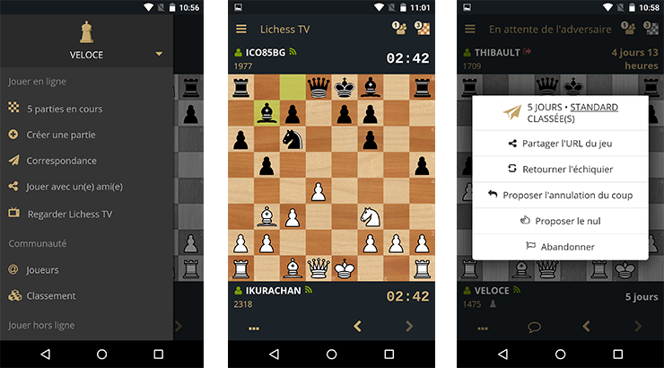

[lichess.org/mobile](http://lichess.org/mobile)
--------------------



Lichess mobile is a [cordova](https://cordova.apache.org/) application written
in [TypeScript](http://www.typescriptlang.org/) and JavaScript. The rendering
library is [mithril.js](http://mithril.js.org/). It uses [babel](http://babeljs.io/),
[browserify](http://browserify.org/) and [gulp](http://gulpjs.com/)
as build tools. It talks to a native [Stockfish](https://stockfishchess.org/) interface, [with multiple variants support](https://github.com/ddugovic/Stockfish), through a
[cordova plugin](https://github.com/veloce/cordova-plugin-stockfish) and uses
an [async chess worker](https://github.com/veloce/scalachessjs) which is based
on [lichess scalachess module](https://github.com/ornicar/scalachess) compiled
to JavaScript.

## Requirements

* [node](http://nodejs.org) v6.x
* [cordova](https://cordova.apache.org/) v6.x

**Android:**

* the [android SDK](http://developer.android.com/sdk/index.html)
* [SDK packages](http://developer.android.com/sdk/installing/adding-packages.html) API 23
* last version of Android SDK tools and platform tools
* [android ndk](http://developer.android.com/tools/sdk/ndk/index.html) for
  stockfish compilation
* make sure the `sdk/tools/` directory is in your path, so you can use `android`
  command everywhere.

**iOS:**

* OS X and [Xcode](https://developer.apple.com/xcode/download/) version 8.x

## Build the web application

Make sure you installed all deps:

    $ npm install

Then copy `env.json.example` to `env.json` and modify settings
to link your app to a lichess server.

To build and watch for changes:

    $ npm run watch

## Build stockfish

### Android

Build the native code using:
```
ndk-build -C platforms/android
```

### iOS

Through XCode, in the build settings menu:
  * Set `C++ Language Dialect` option to `C++11` value.
  * Set `C++ Standard Library` option to `lib++` value.

## Advanced setup

See the wiki.
